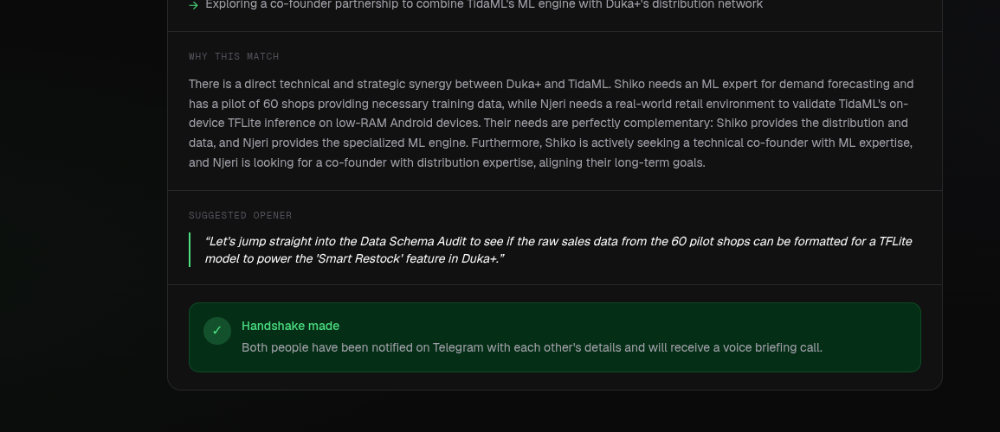
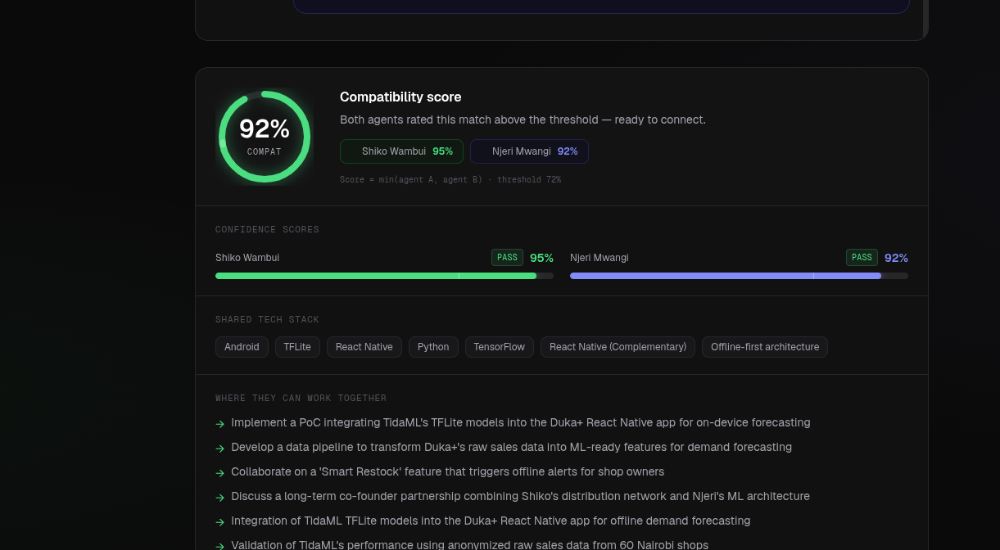
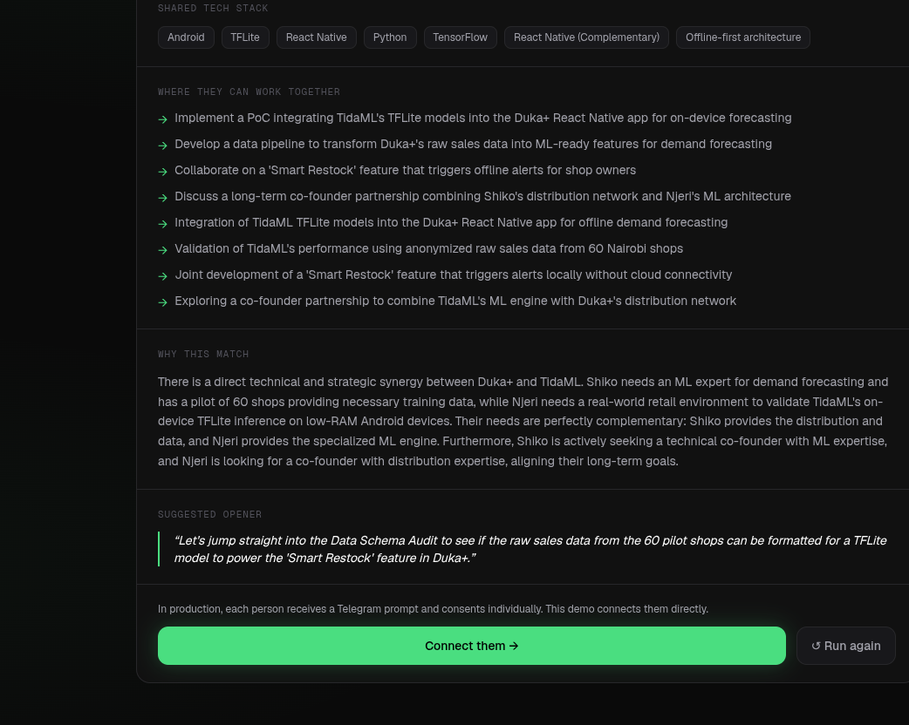

# Kuzana Connector

> *"Your agent works the room so you don't have to."*

AI-powered matchmaking for the Kuzana/MiniHack Kenya community. Instead of introducing you to people, it builds you an agent — and that agent negotiates introductions on your behalf.

## Screenshots

<p align="center">
  
  
  
</p>

---

## How It Works

```
1. Onboard via Telegram → 5-minute conversational interview
2. Agent instantiated from your profile (Gemini)
3. Every 2 hours: pgvector finds candidate pairs
4. Agent-to-agent negotiation (3-turn Gemini conversation)
5. Both scores > 0.72 → Telegram notification
6. Both consent → ElevenLabs voice call with context briefing
7. 24h later → feedback loop (thumbs up/down updates matching weights)
```

## Tech Stack

| Layer | Tool |
|---|---|
| Onboarding & notifications | Telegram Bot API |
| Conversation & agents | Gemini |
| Embeddings | Gemini embeddings |
| Database + vector search | Supabase + pgvector |
| Voice introductions | ElevenLabs Conversational AI |
| Scheduler | node-cron |

## Setup

### 1. Install

```bash
npm install
```

### 2. Configure environment

```bash
cp .env.example .env
# Fill in all values
```

Required variables:
- `TELEGRAM_BOT_TOKEN` — from @BotFather
- `GEMINI_API_KEY` — for onboarding, agent negotiation, call scripts, and embeddings
- `SUPABASE_URL` + `SUPABASE_SERVICE_KEY` — from your Supabase project
- `ELEVENLABS_API_KEY` + `ELEVENLABS_AGENT_ID` — from ElevenLabs dashboard

### 3. Run Supabase migrations

Paste and run `src/db/schema.sql` in your Supabase project's SQL editor.

### 4. Start

```bash
npm run dev        # Development (ts-node-dev with hot reload)
npm run build      # Compile TypeScript
npm start          # Run compiled output
```

---

## Telegram Commands

| Command | Action |
|---|---|
| `/start` | Begin onboarding — creates your profile and activates your agent |
| `/status` | View your current profile |
| `/setphone +254...` | Add phone number for ElevenLabs voice introductions |
| `/rematch` | Trigger an immediate matching cycle |
| `/help` | Show all commands |

---

## Architecture

```
ONBOARDING LAYER
  Telegram Bot + Gemini-powered interview
  Profile extraction -> Supabase users table
  Gemini embeddings (goals + challenges vectors)
        |
MATCHING ENGINE
  node-cron: every 2 hours
  pgvector cosine similarity (goal <-> challenge)
  Candidate pairs: similarity > 0.65
        |
AGENT-TO-AGENT NEGOTIATION
  Agent A: introduces User A's context and need
  Agent B: assesses relevance + offering
  Independent scoring: both must exceed 0.72
  Full transcript stored as match artifact
        |
INTRODUCTION LAYER
  Telegram consent notification (inline keyboard)
  Both consent -> ElevenLabs outbound call
  30-second personalised voice briefing per person
        |
FEEDBACK LAYER
  Telegram follow-up 24h post-call
  Ratings stored for matching improvement
```

---

## Project Structure

```
src/
├── index.ts                 # Entry point
├── config.ts                # Environment config
├── types.ts                 # TypeScript interfaces
├── db/
│   ├── schema.sql           # Supabase schema + pgvector
│   └── supabase.ts          # DB client + typed queries
├── bot/
│   ├── index.ts             # Bot setup, routing, commands
│   ├── onboarding.ts        # Gemini-powered interview flow
│   └── notifications.ts     # Match notifications, consent, feedback
├── agents/
│   ├── prompts.ts           # Agent system prompt generation
│   └── negotiation.ts       # 3-turn agent-to-agent negotiation
├── matching/
│   ├── embeddings.ts        # Gemini embedding generation
│   └── scheduler.ts         # Cron scheduler + matching cycle
├── introduction/
│   ├── callscript.ts        # Gemini call script generation
│   └── elevenlabs.ts        # ElevenLabs outbound call API
└── utils/
    ├── logger.ts             # Structured JSON logger
    └── retry.ts              # Exponential backoff helper
```

---

## Matching Algorithm

**Stage 1 — Candidate selection (fast)**

Match User A's `goal_embedding` against all other users' `challenge_embedding` using
cosine similarity via pgvector HNSW index. Threshold: 0.65.

**Stage 2 — Agent negotiation (quality filter)**

For each candidate pair:
- Agent A (built from User A's profile) introduces their context and need
- Agent B responds with relevance assessment
- Both agents independently score the match (0.0-1.0)
- Both scores must exceed 0.72 to escalate to humans

The full transcript is stored and becomes the introduction artifact.

---

## ElevenLabs Setup

1. Create a Conversational AI agent in your ElevenLabs dashboard
2. Note the Agent ID -> set as `ELEVENLABS_AGENT_ID`
3. Users add their phone with `/setphone +254...`

Without a phone number, the bot sends contact info via Telegram instead (fallback path).

---

*Built for MiniHack | Kuzana ecosystem | Kenya*
